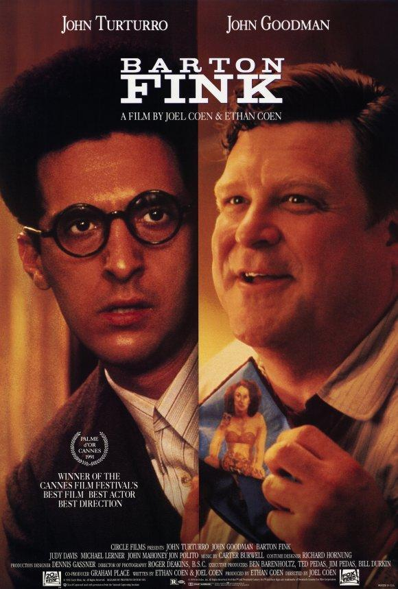
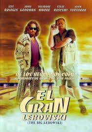
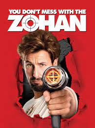

<!DOCTYPE html>
<html lang="es">
<head>
    <meta charset="UTF-8">
    <meta http-equiv="X-UA-Compatible" content="IE=edge">
    <meta name="viewport" content="width=device-width, initial-scale=1.0">
    <link rel="stylesheet" href="styles.css">
    <link rel="stylesheet" href="fontawesome/fontawesome-free-6.3.0-web/css/all.css">
    <title>CV Gabriel Moreno</title>
</head>
<body>
    <header>
        <nav>
            
            <ul>
            <li><a href="#informacion">Inicio</a></li>
            <li><a href="#perfil">Perfil profesional</a></li>
            <li><a href="#resumen">Contacto y resumen</a></li>
        </ul>
        </nav>
    </header>
    <main>
    <section id="informacion"> 
    
    <h1>Gabriel Moreno</h1>
    <h2>Actor</h2>
    
    
Actor polifacético, con 40 años en el medio actoral. Me formé directamente en los teatros de Madrid, actuando en 5 producciones profesionales, en los 5 primeros años de mi carrera. Después, cambie al cine, medio en el que me he especializado los últimos 15 años, principalmente en géneros de drama, actuando en 16 producciones cinematográficas con 1 protagónico. Actualmente, estoy interesado en profundizar mi experiencia en dirección de castings para largometrajes, así como, impartir clases de actuación.
    </section>
    <section id="perfil">
        <h2>Perfil profesional</h2>
    <section id="peliculas">
        

            Naci en Brooklyn, Nueva York, Estados Unidos, en 1957. Soy un actor, guionista y productor italoamericano de origen siciliano y apuliano, que proviene de una familia de artistas.
He aparecido en más de sesenta películas, en las que, a menudo, ejerce roles de personaje desequilibrado. Tengo varias actuaciones memorables, como su baile en la bolera al son de los Gipsy Kings en El gran Lebowski o su papel como Barton Fink en la película homónima, donde interpretaba a un dramaturgo fichado por Hollywood, que espera ansioso la llegada de la inspiración, trabajo por el que fui premiado como mejor actor en Cannes.
            

            <ul>
                <li>1998 El Gran Lebowski</li>
                <li>2001 Vidas contadas</li>
                <li>2004 La ventana secreta</li>
                <li>2007 Transformers</li>
                <li>2014 Exodus: Dioses y reyes</li>
                <li>2022 The Batman</li>
            </ul>
            <h2>Una de mis escenas mas famosas</h2>
            <iframe width="560" height="315" src="https://www.youtube.com/embed/8Mt7wv7gRs0" title="YouTube video player" frameborder="0" allow="accelerometer; autoplay; clipboard-write; encrypted-media; gyroscope; picture-in-picture; web-share" allowfullscreen></iframe>
        

        

            

                
                <a href="https://www.espinof.com/criticas/barton-fink-el-infierno-del-escritor">Barton Fink</a>
            

            

                 
                <a href="https://www.micropsiacine.com/2020/07/clasicos-online-critica-de-el-gran-lebowski-de-los-hermanos-coen-netflix/">El gran lebowsky</a>
            

            

                
                <a href="https://www.otroscines.com/nota?idnota=1906">No te metas con zohan</a>
            

            

                
                <a href="https://www.espinof.com/criticas/the-batman-extraordinaria-joya-oscura-forma-brillante-ejecucion-que-trasciende-a-etiqueta-cine-superheroes">The batman</a>
                
            

        

    
    </section>
</section>
<section class="resumen" id="resumen">
    

        <h2 class="titulo-seccion">Resumen</h2>
        <h3>Mi preparación y experiencia</h3>
        

            

                Educación
                

                    

                        

                            <h3>2006 - 2010</h3>
                        

                        

                            Real Escuela Superior de Arte Dramático, RESA
                        

                    

                

                

                    

                        

                            <h3>2010 - 2011</h3>
                        

                        

                            Curso Avanzado de Expresión Corporal 
                        

                    

                

            

            

                Habilidades
                

                    

                        

                            <h3>Idiomas</h3>
                        

                        

                            Ingles castellano e italiano en un nivel avanzado, frances en un nivel intermedio.
                        

                    

                

                

                    

                        

                            <h3>Produccion</h3>
                        

                        

                            Amplio conocimiento de las producciones teatrales
                        

                    

                

            

        

    

    

        Premios
        
 

            Festival Internacional de Cine de Xixón 
            
            Mejor Actriz de Reparto para “Lucía” en“Todos queremos lo mejor para él” de Bran Coll, 2012
            
             
            
            Mostra Internacional de Cine do Xacobeo de Pontevedra
    
            Mejor Película para “La octava dimensión” de Manuel Jaro 2018

    

    

        Referencias
        
 Pablo Daniel Cuatrin Louis Vuitton San Francisco Tel. (551) 123-756 Email: Cuatrin@email.com 

    

    

        <i class="fa-brands fa-whatsapp"></i>
        <h2>+52 1123445566</h2>
    

    

        <i class="fa-brands fa-instagram"></i>
        <a href="#">@MorenoGabriel_</a>
    

    

        <i class="fa-brands fa-linkedin"></i>
        <a href="http://ca.linkedin.com/in/linkedinyourname.">Gabriel Moreno</a>
    

    

        
        
 

</section>
    </main>
    
    <footer>
        <form action="" class="formulario" id="formulario">

			

				<label for="nombre" class="formulario__label">Nombre</label>
				

					<input type="text" class="formulario__input" name="nombre" id="nombre" placeholder="John Doe">
					<i class="formulario__validacion-estado fas fa-times-circle"></i>
				

				
El usuario tiene que ser de 4 a 16 dígitos y solo puede contener numeros, letras y guion bajo.

			

		
			

				<label for="correo" class="formulario__label">Correo Electrónico</label>
				

					<input type="email" class="formulario__input" name="correo" id="correo" placeholder="correo@correo.com">
					<i class="formulario__validacion-estado fas fa-times-circle"></i>
				

				
El correo solo puede contener letras, numeros, puntos, guiones y guion bajo.

			

			

				<label for="telefono" class="formulario__label">Teléfono</label>
				

					<input type="text" class="formulario__input" name="telefono" id="telefono" placeholder="4491234567">
					<i class="formulario__validacion-estado fas fa-times-circle"></i>
				

				
El telefono solo puede contener numeros y el maximo son 14 dígitos.

			

			

				
<i class="fas fa-exclamation-triangle"></i> <b>Error:</b> Por favor rellena el formulario correctamente. 

			

			

				<button type="submit" class="formulario__btn">Enviar</button>
				
Formulario enviado exitosamente!

			

		</form>
    </footer>
    
    </body>
</html>
